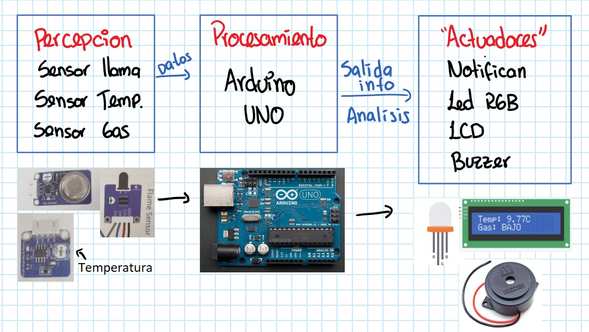
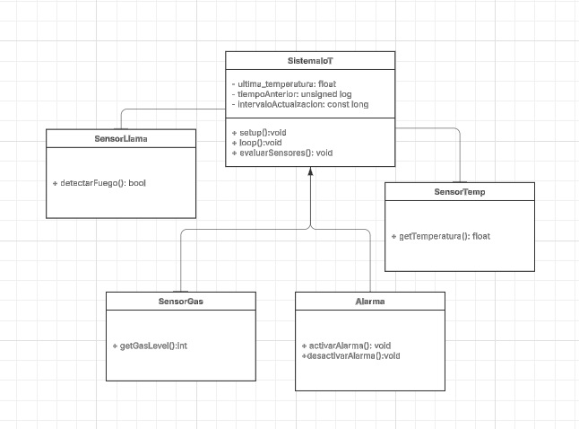
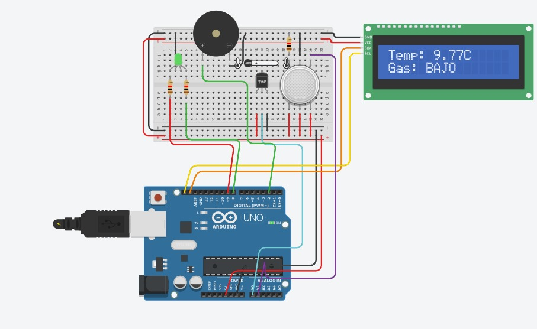
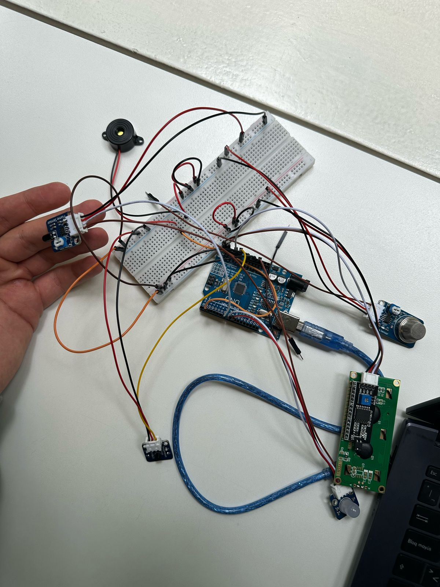
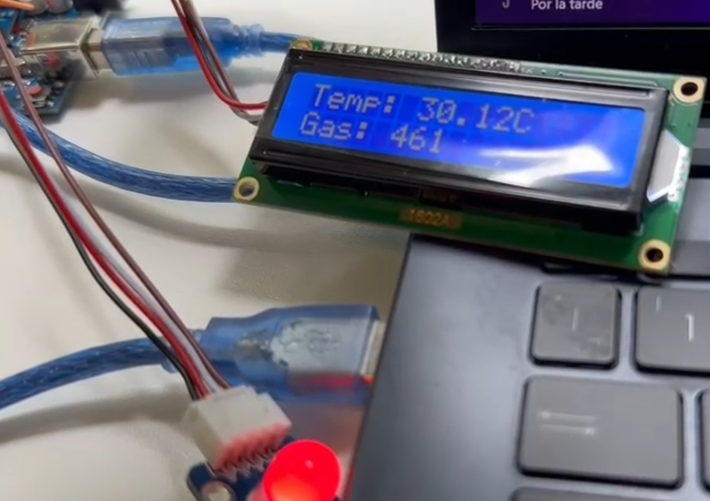
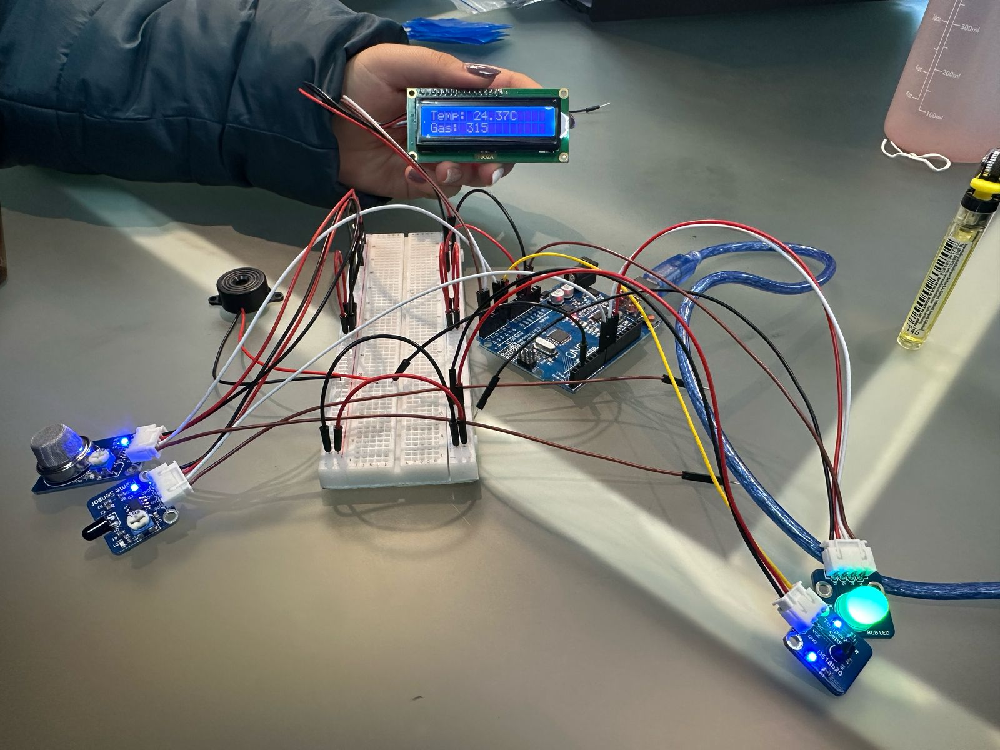

# Reto1
## Miembros: Samuel Rodriguez, Valentina Ruiz Torres y Darek Aljuri Martínez

## 1. Introducción
### 1.1 Resumen General
El presente documento describe el desarrollo de un sistema IoT para la detección temprana de incendios en los cerros orientales de Bogotá. Se detallan las etapas de diseño, desarrollo, implementación y validación de la solución, asegurando que el prototipo sea funcional y eficiente en la identificación de riesgos de incendio mediante sensores de temperatura, gas y llama. La solución utiliza un microcontrolador Arduino Uno junto con una pantalla LCD y un buzzer para proporcionar alertas locales.

### 1.2 Motivación
Los incendios forestales en los cerros orientales de Bogotá representan una amenaza ambiental y social. La detección oportuna de incendios puede mitigar los daños y facilitar una respuesta rápida por parte de las autoridades. El uso de tecnología IoT permite un monitoreo en tiempo real, mejorando la capacidad de reacción ante incendios y minimizando sus consecuencias.

### 1.3 Justificación
El desarrollo de este sistema responde a la necesidad de implementar una solución de bajo costo y fácil implementación que pueda alertar sobre incendios forestales en zonas vulnerables. Mediante sensores especializados, el sistema puede detectar la presencia de gases y variaciones anómalas de temperatura, proporcionando información en tiempo real para la toma de decisiones.

### 1.4 Estructura de la Documentación
Este documento se divide en las siguientes secciones:

- Introducción: Contextualización del problema, motivación y justificación del sistema.
- Solución Propuesta: Descripción detallada del diseño, restricciones y arquitectura del sistema.
- Configuración Experimental y Resultados: Evaluación del sistema en diferentes condiciones.
- Autoevaluación del Protocolo de Pruebas: Validación de la efectividad del prototipo.
- Conclusiones y Trabajo Futuro: Reflexión sobre los logros alcanzados y posibles mejoras.
- Anexos: Código fuente, esquemáticos y material complementario.

## 2. Solución Propuesta
### 2.1 Restricciones de Diseño

***Técnicas***
- Uso de un Arduino Uno como microcontrolador central. Ya que "es una plataforma de desarrollo basada en una placa electrónica de hardware libre que incorpora un microcontrolador re-programable y una serie de pines hembra" [1], esto permite establecer conexiones entre el microcontrolador y los sendroes y actuadores, tiene entradas analogas y digitales.
- Sensor de temperatura DS18B20, "permite medir la temperatura a través de un termistor NTC, un comparador LM393, y un potenciometro"[2], esto le permite al sensor adecuar una señal de trabajo operable digital.
- Sensor de gas (MQ-2), "Este sensor es adecuado para detectar GLP, I-butano, propano, metano, alcohol, hidrógeno y humo. Tiene alta sensibilidad y respuesta rápida"[3], ademas de esto cuenta con un potenciometrp para ajustar la sensibilidad.
- Sensor de Llama (KY-026). "Consta de un LED receptor de infrarrojos de 5 mm, un comparador diferencial dual LM393, un potenciómetro de recorte de 3296 W, 6 resistencias, y 4 pines de cabezal macho"[4] Es decir que detecta la luz infrarroja emitida por el fuego, y debido a su potenciometro se puede ajustar su sensibilidad.
- Pantalla LCD para visualización de datos en tiempo real.
- Buzzer para alertas sonoras en caso de detección de incendio.
  
***Económicas***
- Implementación con componentes de bajo costo y accesibles.
- Uso de software de arduino para minimizar costos de desarrollo.
  
***Espacio y Escalabilidad***
- Diseño compacto para facilitar su instalación en zonas estratégicas.
- Posibilidad de ampliar el sistema mediante comunicación con otros dispositivos IoT.
- Adaptabilidad para futuras mejoras con nuevos sensores o algoritmos de detección.
  
***Temporales***
- Desarrollo del prototipo en un plazo limitado, asegurando funcionalidad básica.
- Posibilidad de mejoras futuras en algoritmos y hardware para mayor precisión.

### 2.2 Arquitectura Propuesta

***Arquitectura IoT del Sistema***

La arquitectura IoT permite la transmisión de información digitalizada a través de la red, llevando los datos capturados por los sensores hacia un centro de procesamiento local o en la nube, donde son analizados y almacenados. Posteriormente, mediante actuadores, se pueden emitir comandos para que los dispositivos conectados ejecuten acciones específicas, como la activación o desactivación de un mecanismo. [5]

El sistema de detección de incendios en los cerros orientales de Bogotá se basa en una estructura distribuida compuesta por sensores, procesamiento local y comunicación de datos para la notificación de alertas. Se organiza en tres capas principales:

1. Capa de Percepción (Sensores y Adquisición de Datos)
Es la capa encargada de capturar la información del entorno mediante sensores físicos. Los dispositivos utilizados incluyen:

- Sensor de temperatura (): Mide la temperatura del aire en la zona monitoreada.
- Sensor de gas (): Detecta concentraciones de gases como CO y CO₂, indicativos de combustión.
- Sensor de llama (): Detecta la presencia de llamas en el área monitoreada.
Los sensores están conectados a un Arduino Uno, que procesa la información en tiempo real.

2. Capa de Procesamiento y Control
El Arduino Uno actúa como la unidad central de procesamiento (CPU), encargada de:

- Leer y analizar los datos recibidos de los sensores.
- Determinar si las condiciones indican un posible incendio.
- Activar mecanismos de alerta local (buzzer, LED y pantalla LCD).

3. Capa de Comunicación y Notificación
En la versión básica del prototipo, las alertas se generan localmente mediante:

- Pantalla LCD: Muestra valores en tiempo real y advertencias.
- LEDs indicadores: Señalización visual de estados normales y de alerta.
- Buzzer: Alarma sonora para advertir de situaciones críticas.

### 2.3 Desarrollo Teórico Modular
- Fiabilidad: Uso de sensores calibrados para evitar falsas alarmas.
- Bajo Consumo Energético: Optimización del código para minimizar consumo.
- Interfaz Intuitiva: Uso de LCD y alertas sonoras para notificaciones claras.
- Escalabilidad: Posibilidad de agregar conectividad remota en versiones futuras.

***Diagramas UML de la Solución y Módulos de Software*** 

Se incluyen los diagramas UML para representar la lógica del software desarrollado, incluyendo:

**Diagrama de Clases:** Estructura del código y relación entre módulos.

**Diagrama de Secuencia:** Flujo de datos entre sensores, Arduino y salidas.
                  
     Usuario          SistemaIoT        SensorTemp      SensorGas       SensorLlama       LCD        Alarma
        |                  |                  |               |                |            |           |
        |----setup()-----> |                  |               |                |            |           |
        |                  |----requestTemp()->|               |                |            |           |
        |                  |<---(temp)---------|               |                |            |           |
        |                  |----readGasLevel()->|--------------|                |            |           |
        |                  |<---(gas)-----------|              |                |            |           |
        |                  |----detectarFuego()->|-------------|                |            |           |
        |                  |<---(fuego)----------|             |                |            |           |
        |                  |----verificarCondiciones()-------->|                |            |           |
        |                  |                                  |                |            |           |
        |                  |----updateLCD()------------------------------------->|            |           |
        |                  |----activarAlarma()------------------------------------------------>|
        |                  |----desactivarAlarma()--------------------------------------------->|
  

**Diagrama de Estados:** Estados del sistema según las condiciones detectadas.

*Estado: Inicio*
  - Inicializa sensores y componentes
  - Transición a → Monitoreo Normal

*Estado: Monitoreo Normal*
  - Lee sensores de temperatura, gas y llama.
  - Muestra valores en LCD.
  - Si lectura_gas > 400 y temperatura <= 30 → Transición a Detección de Gas Alto.
  - Si estado_llama == LOW → Transición a Detección de Llama.
  - Si abs(temperatura - ultima_temperatura) > 5 → Transición a Incremento Brusco de Temperatura.
  - Si lectura_gas > 400 && temperatura > 30 → Transición a Alarma Activada (nuevo caso).

*Estado: Detección de Gas Alto*
  - Activa LED rojo.
  - Si lectura_gas > 400 && temperatura > 30 → Transición a Alarma Activada.
  - Si lectura_gas <= 400 → Transición a Monitoreo Normal.

*Estado: Detección de Llama*
  - Activa LED rojo y bocina.
  - Transición inmediata a → Alarma Activada.

*Estado: Incremento Brusco de Temperatura*
  - Si abs(temperatura - ultima_temperatura) > 5 → Activa LED rojo y bocina.
  - Transición inmediata a → Alarma Activada.

*Estado: Alarma Activada*
  - Activa LED rojo y bocina.
  - Muestra alerta en LCD.
  - Si (estado_llama == HIGH && lectura_gas <= 400 && temperatura estable) → Transición a Alarma Desactivada.

*Estado: Alarma Desactivada*
  - Apaga LED rojo y bocina.
  - Transición a → Monitoreo Normal.

**Esquemático de Hardware**
El diseño del hardware incluye la interconexión entre los sensores, el Arduino Uno, la pantalla LCD, el buzzer y los LEDs.

**Estándares de Diseño Aplicados**
Normas de seguridad electrónica para evitar riesgos eléctricos.
Buenas prácticas de programación en Arduino (uso eficiente de memoria y procesamiento).
Normas de comunicación de sensores para asegurar compatibilidad y precisión.

## 3. Configuración Experimental, Resultados y Análisis
### 3.1 Configuración Experimental
Para evaluar el funcionamiento del sistema de detección de incendios, se diseñaron pruebas en condiciones controladas que simulan distintos escenarios de emergencia. Se realizaron experimentos variando la presencia de calor, gases y llamas para validar la respuesta del sistema.

**Entorno de prueba:** Espacio cerrado con ventilación controlada/ laboratorio con la ventana abierta.

**Variables medidas:** Temperatura (°C), concentración de gas (valor analógico) y detección de llama (binario).

***Procedimiento:***
- Prueba de detección de llama: Se utilizó una fuente de fuego controlada para activar el sensor de llama, un encendedor.
- Prueba de detección de gas: Se expuso el sensor MQ-2 a diferentes situaciones:
  - Tapar el sensor con la mano: Puede causar un aumento temporal en la lectura porque se acumulan pequeñas cantidades de gas o humedad.
  - Solpar sobre el sensor, el MQ-2 puede reaccionar al CO₂ de la respiración, es decir si se sopla con la boca el CO₂ y la humedad pueden alterar la lectura.
  - Acercar un encendedor sin encenderlo: Los sensores MQ-2 pueden detectar el gas butano del encendedor, es decir debería aumentar la lectura de gas y activar la alarma si está bien calibrado.
- Prueba de temperatura: Se aumentó la temperatura gradualmente con una fuente de calor.
- Evaluación del LCD y alerta sonora: Se verificó la correcta visualización de datos y activación del buzzer ante condiciones de riesgo.
  
### 3.2 Resultados Obtenidos
Los resultados obtenidos en las pruebas de detección fueron satisfactorios en la mayoría de los casos.

## Pruebas del Sistema IoT de Detección de Incendios

| **Prueba**                  | **Condición Simulada**                 | **Respuesta Esperada**                              | **Respuesta Observada** |
|-----------------------------|----------------------------------------|----------------------------------------------------|-------------------------|
| **Detección de llama**       | Encendido de una llama cercana        | Activación de buzzer/LED y alerta en LCD              | ✅ Correcto              |
| **Detección de gas**         | Exposición a gas (tapando el sesnor, soplando y con el encendedor sin prender)           | Cambio de LED verde a rojo                        | ✅ Correcto              |
| **Aumento de temperatura**   | Temperatura > 30°C                    | Cambio de LED verde a rojo             | ✅ Correcto              |
| **Combinación de factores**  | Temperatura alta + gas        | Activación total de alarmas (Buzzer, led, lcd)                       | ✅ Correcto              |

### 3.3 Análisis de los Resultados
Los resultados muestran que el sistema es capaz de detectar condiciones de incendio de manera efectiva. Sin embargo, se identificaron algunos aspectos de mejora:

- Tiempo de respuesta del sensor de gas: En algunas pruebas, el MQ-2 tardó unos segundos en reaccionar a concentraciones bajas de gas y el sesnro de temperatura tardo tambien en detectar "altas" temperaturas
- Interferencia en el sensor de llama: En presencia de objetos muy cercanos, el sensor de llama presentó algunas lecturas falsas.
- Precisión del sensor de temperatura: Se recomienda utilizar una calibración adicional para mejorar la precisión en entornos con variaciones bruscas de temperatura. En general es muy importante calibrar el sensor igual que el de llama para que reconozcan los niveles que se necesitaron
- 
  
## 4. Autoevaluación del Protocolo de Pruebas
El protocolo de pruebas aplicado permitió validar el correcto funcionamiento del sistema, pero se identifican oportunidades de mejora:

- Fortalecer la calibración de sensores: Ajustar umbrales para mejorar la sensibilidad en condiciones de baja detección.
- Incluir pruebas en exteriores: Evaluar el rendimiento en condiciones ambientales reales, considerando factores como viento y humedad.
- Medición del consumo energético: Para determinar la viabilidad de una alimentación con batería en entornos remotos.

## 5. Conclusiones y Trabajo Futuro
### 5.1 Retos Presentados Durante el Desarrollo
Durante el desarrollo del proyecto, se enfrentaron varios desafíos, entre ellos:

- Limitaciones en la sensibilidad de los sensores: Algunos sensores requieren tiempos de calibración o ajustes de umbral.
- Interferencias ambientales: Se detectaron lecturas erróneas en entornos con iluminación intensa o fluctuaciones de temperatura.
- Integración de múltiples sensores: La sincronización de las lecturas para evitar falsos positivos requirió ajustes en el código.
- Dificultad en la obtención e instalación de librerías: Para poder trabajar con el sensor DS18B20 y la pantalla LCD, fue necesario encontrar e instalar las librerías adecuadas. En particular, usamos las siguientes:
  - OneWire.h: Para la comunicación con el sensor de temperatura DS18B20.
  - DallasTemperature.h: Para procesar los datos del sensor DS18B20.
  - Wire.h y LiquidCrystal_I2C.h: Para manejar la pantalla LCD con comunicación I2C.

Encontrar las versiones correctas y lograr que funcionaran correctamente en el entorno de desarrollo tomó tiempo.
- Conversión de temperatura: Inicialmente, no sabíamos si la temperatura obtenida del sensor DS18B20 estaba en grados Celsius o Fahrenheit. Implementar la fórmula de conversión fue un reto, ya que el sensor devuelve la temperatura en Celsius por defecto, pero hubo confusión con las configuraciones y ajustes previos. Se consideró la fórmula: T(°C)=(T(°F)-32)*5/9

​Sin embargo, al final se confirmó que el sensor ya devolvía los valores en Celsius, lo que evitó conversiones adicionales.
### 5.2 Conclusiones
Se logró diseñar un sistema funcional de detección de incendios basado en sensores de llama, gas y temperatura.
Las pruebas experimentales confirmaron que el sistema puede detectar situaciones de riesgo y activar alertas visuales y sonoras.
Se identificaron oportunidades de mejora para aumentar la precisión y confiabilidad del sistema en condiciones reales.

### 5.3 Trabajo Futuro
Para mejorar la efectividad del sistema, se proponen las siguientes líneas de trabajo:

- Incorporación de conectividad IoT: Uso de módulos WiFi o LoRa para enviar alertas a las autoridades en tiempo real.
- Optimización de la alimentación energética: Implementación de baterías recargables o paneles solares para autonomía en campo.
- Mejora en la detección de fuego: Uso de sensores infrarrojos más avanzados para evitar falsas detecciones por iluminación externa.
- Desarrollo de una interfaz gráfica: Creación de una aplicación para monitoreo remoto de los valores registrados.

## 6. Anexos
### Codigo Arduino comentado
            
    #include <Wire.h>  // Librería para comunicación I2C
    #include <LiquidCrystal_I2C.h>  // Librería para pantalla LCD I2C
    #include <OneWire.h>  // Librería para comunicación con sensores OneWire
    #include <DallasTemperature.h>  // Librería para el sensor de temperatura DS18B20
    
    // Definición de pines
    #define DS18B20_PIN A0  // Pin analógico donde está conectado el sensor DS18B20
    #define SENSOR_LLAMAS 7  // Pin digital donde está conectado el sensor de llama
    
    // Inicialización de la pantalla LCD
    LiquidCrystal_I2C lcd(0x27, 16, 2);  // Dirección 0x27, pantalla de 16x2
    OneWire oneWire(DS18B20_PIN);  // Configuración del protocolo OneWire para el sensor de temperatura
    DallasTemperature sensores(&oneWire);  // Creación del objeto para manejar el sensor de temperatura
    
    // Definición de pines adicionales
    const int sensor_gas = A1;  // Pin analógico donde está conectado el sensor de gas
    int rojo = 9;  // LED rojo para alerta
    int verde = 8;  // LED verde para estado normal
    int bocina = 2;  // Buzzer para alarma
    
    // Variables de control
    double ultima_temperatura = 0;  // Última temperatura registrada
    unsigned long tiempoAnterior = 0;  // Tiempo de la última actualización de la pantalla LCD
    const long intervaloActualizacion = 500;  // Intervalo de actualización de la pantalla (500 ms)
    
    void setup() {
      Serial.begin(9600);  // Iniciar comunicación serial
      lcd.init();  // Iniciar la pantalla LCD
      lcd.backlight();  // Encender la luz de fondo de la pantalla LCD
    
      // Configuración de pines de salida
      pinMode(rojo, OUTPUT);
      pinMode(verde, OUTPUT);
      pinMode(bocina, OUTPUT);
      pinMode(SENSOR_LLAMAS, INPUT);  // Configurar el sensor de llama como entrada
    
      sensores.begin();  // Iniciar el sensor DS18B20
    }
    
    void loop() {
      unsigned long tiempoActual = millis();  // Obtener el tiempo actual
    
      sensores.requestTemperatures();  // Solicitar temperatura al sensor
      float temperatura = sensores.getTempCByIndex(0);  // Obtener temperatura en grados Celsius
    
      int lectura_gas = analogRead(sensor_gas);  // Leer el valor del sensor de gas
      int estado_llama = digitalRead(SENSOR_LLAMAS);  // Leer el estado del sensor de llama
    
      Serial.print("Llama (digital): ");
      Serial.println(estado_llama);
    
      // Detectar cambios bruscos de temperatura
      bool incremento_brusco = abs(temperatura - ultima_temperatura) > 5;
    
      // 🔥 Si detecta fuego (estado_llama == 0), activar alarma
      if (estado_llama == LOW) {  // LOW significa que detecta fuego
        Serial.println("¡ALERTA! FUEGO DETECTADO");
        digitalWrite(rojo, HIGH);  // Encender LED rojo
        digitalWrite(verde, LOW);  // Apagar LED verde
        digitalWrite(bocina, HIGH);  // Activar buzzer
      } else {
        digitalWrite(rojo, LOW);  // Apagar LED rojo
        digitalWrite(bocina, LOW);  // Apagar buzzer
      }
    
      // Si ha pasado el intervalo de actualización, refrescar la pantalla LCD
      if (tiempoActual - tiempoAnterior >= intervaloActualizacion) {
        tiempoAnterior = tiempoActual;  // Actualizar el tiempo anterior
        lcd.clear();  // Limpiar pantalla LCD
    
        // Condición de alerta: fuego, cambio brusco de temperatura o gas alto con temperatura elevada
        if (incremento_brusco || estado_llama == LOW || (temperatura > 30 && lectura_gas > 400)) { 
          lcd.setCursor(0, 0);
          lcd.print("ALERTA: FUEGO");  // Mostrar alerta en pantalla LCD
          lcd.setCursor(0, 1);
          lcd.print("Gas: ");
          lcd.print(lectura_gas);
          digitalWrite(rojo, HIGH);  // Encender LED rojo
          digitalWrite(verde, LOW);  // Apagar LED verde
          digitalWrite(bocina, HIGH);  // Activar buzzer
        } 
        else {
          lcd.setCursor(0, 0);
          lcd.print("Temp: ");
          lcd.print(temperatura);
          lcd.print("C");  // Mostrar temperatura en la pantalla LCD
    
          lcd.setCursor(0, 1);
          lcd.print("Gas: ");
          lcd.print(lectura_gas);  // Mostrar nivel de gas en la pantalla LCD
    
          // Indicar si los valores son seguros o peligrosos
          if (lectura_gas > 400 || temperatura > 30) {
            digitalWrite(rojo, HIGH);  // Encender LED rojo si hay riesgo
            digitalWrite(verde, LOW);
          } else {
            digitalWrite(rojo, LOW);
            digitalWrite(verde, HIGH);  // Encender LED verde si todo está normal
          }
          
          digitalWrite(bocina, (temperatura > 30 && lectura_gas > 400) ? HIGH : LOW);  // Activar buzzer si hay alerta
        }
      }
    
      ultima_temperatura = temperatura;  // Guardar la última temperatura registrada
      delay(200);  // Pequeña pausa antes de la siguiente iteración
    }

### Implementacion Fisica

En la imagen se puede observar el cableado físico del proyecto, incluyendo la protoboard y el Arduino. También se aprecia la conexión de los sensores, mostrando cómo están integrados en el sistema.

En esta imagen se puede observar que tanto el nivel de gas como la temperatura han superado los límites establecidos. Como consecuencia, el LED indicador se ilumina en rojo y la alarma se activa, alertando sobre una posible situación de riesgo.

En esta imagen se puede observar que tanto el nivel de gas como el de temperatura se encuentran dentro de los límites seguros, es decir, por debajo del umbral de 400 y de 30°C. Como resultado, la alarma no se activa y el LED indicador permanece en color verde, señalando un estado normal y sin riesgos

En la imagen se muestra la prueba del sensor de llama, donde al acercar un encendedor encendido, el sistema detecta la presencia de fuego. Como resultado, se activa una alarma y en la pantalla LCD aparece el mensaje "ALERTA: FUEGO"

## 7. Referencias 

 1: Arduino.cl, "¿Qué es Arduino?", https://arduino.cl/que-es-arduino/ (accedido: 16 de febrero de 2025). 
 
 2: Robotlandia, "Módulo KY-028 Sensor de Temperatura Digital", https://robotlandia.es/temperatura-y-humedad/681-modulo-ky-028-sensor-de-temperatura-digital.html (accedido: 16 de febrero de 2025).

 3: Julpin, "Módulo Sensor Analógico de Gas MQ-2 para Arduino", https://www.julpin.com.co/inicio/modulos-sensores/492-modulo-sensor-analogico-de-gas-mq-2-para-arduino.html (accedido: 16 de febrero de 2025).

 4: D Bots, "KY-026 Módulo Sensor de Llama", https://3dbots.co/producto/ky-026-modulo-sensor-de-llama/ (accedido: 16 de febrero de 2025).

 5: UNIR, "¿Qué es la arquitectura IoT y dónde se emplea?", https://www.unir.net/revista/ingenieria/arquitectura-iot/ (accedido: 16 de febrero de 2025).

6: A. Cortés, "Proyecto 14: Módulo Sensor de Llama", https://acortes.co/proyecto-14-modulo-sensor-de-llama/ (accedido: 16 de febrero de 2025).
